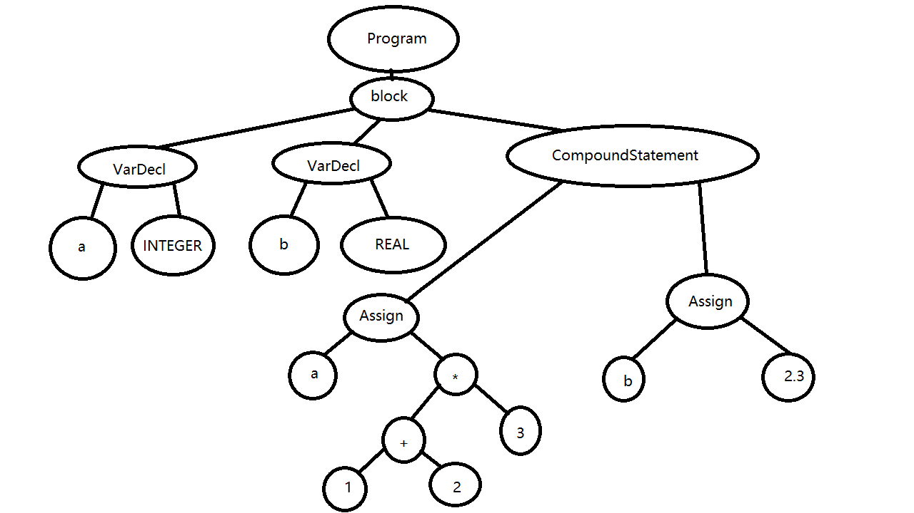
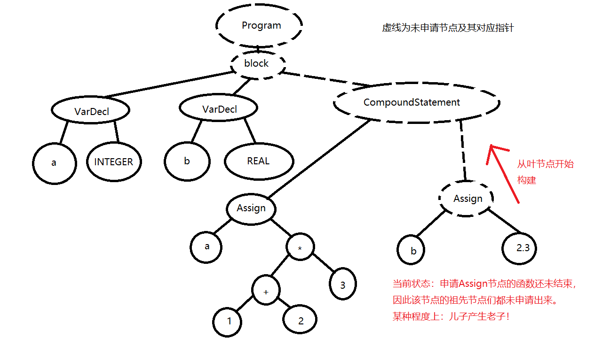

<!--
 * @Author       : Daniel_Elendeer
 * @Date         : 2021-03-11 14:40:44
 * @LastEditors  : Daniel_Elendeer
 * @LastEditTime : 2021-03-11 16:25:05
 * @Description  :
-->

# AST构建过程中的内存管理

ESI的parser是根据*上下文无关语法*设计的语法解析器，由于会在解析的过程中
构造抽象语法树（AST），某种程度上也可以说是抽象语法树构造器。

在构造抽象语法树的过程中不可避免的有内存申请的操作，**本篇文档将讨论
本项目中使用了什么样的方法来管理这些内存，使得在解释器运作的过程中
不会因为异常的触发而导致内存泄漏**。

相关项目文件：[src/parser.cpp](../parser.cpp)

---

## 节点如何申请

parser内有一系列根据上下文无关语法设计的函数，这些函数将根据语法去“期待”一些
Token，并在成功执行函数之后申请一个相应的节点，返回一个指向节点的指针。
节选函数`AST *Parser::program()`为例：

根据规则

$$
program : PROGRAM\ variable\ SEMI\ block\ DOT
$$

设计出函数：

```cpp
AST *Parser::program() {
    eat(TokenType::PROGRAM);
    AST * var_node = variable();
    std::string program_name = dynamic_cast<Var *>(var_node) -> getVal();

    eat(TokenType::SEMI);

    AST * block_node = block();
    eat(TokenType::DOT);

    return new Program(program_name, block_node);
}
```

开头的`eat`函数期待一个关键字（当然了，parser看到的是token）PROGRAM的输入，
不妨看一下`eat`函数的内部：

```cpp
void Parser::eat(TokenType token_type) {
    if (m_current_token.getType() == token_type) {
        m_current_token = m_lexer.get_next_token();
    }
    else {
        string message = "Invailid Syntax : Unexpected token.\n\texpected "
            + Token::map_token_type_string.at(token_type)
            + ", met " + Token::map_token_type_string.at(m_current_token.getType());

        error(message);
    }
}
```

可见，当`eat`函数“吃到它想吃的token”时，会将parser自身的`m_current_token`
更新到下一个token，否则抛出异常。

假如解释器解释的源代码是完全符合语法的，那么在`program`函数结尾，它将使用`new`
申请一个`Program`节点（该节点是一种AST节点，派生自基类`AST`），并返回一个指向
这个节点的指针。

可以看到，在`program`函数中，调用了`variable`、`block`等其他函数，它们
同样是根据相对应的语法设计的、返回相应节点的函数。parser在`parse`
函数中对这些函数
层层调用，在函数内申请一个个节点并互相连接，构建出一棵抽象语法树。

## 节点如何析构

节点的析构相对简单。

先看一下基类AST的析构函数：

```cpp
AST::~AST() {
    for (auto p : m_children) {
        if (p != nullptr) {
            delete p;
        }
    }
}
```

我们可以看到，如果一个AST节点被析构，它会在析构函数里尝试`delete`它的子节点。
因此，如果一个AST节点被析构，以该节点为根节点的子树将被析构。

假如构建AST的过程顺利，最终parser的`parse`函数会构建出一整棵抽象语法树
并返回它的根节点指针。这时如果我们想释放所有申请到的节点的内存，只需要
简单把根节点`delete`掉，整个抽象语法树就会被从叶节点到根节点全部释放。

> 这样的做法当然方便释放内存，却会增加栈空间开支，因为在析构节点时，
> 如果它的子节点没有被完全析构，这个节点本身的析构函数也无法结束。

---

## 触发异常时如何安全释放所有节点

`eat`函数带有语法检查的功能，在遇到不符合语法要求的token时会抛出异常，
这种异常大多数时候是在解析一半的时候发生的，即，AST只构建了一部分。

根据函数调用的原理，如果函数内有节点申请的话，最先return的函数
最先完成节点的申请。最先调用的函数，则必须让函数内调用的其他函数完成节点申请
之后，才能完成本函数内的节点申请。

如上述的`program`函数，`variable`和`block`函数中的节点申请必然需要先完成，
否则`program`函数内的`Program`节点就无法申请。

也就是说，AST是从叶节点开始申请节点并构造的。

若一棵AST最终长成这样：



那么它在构建过程中是这样的状态：



这个过程中子树的数量和根节点将会不断变化，
因此，要在过程中追踪各个子树的根节点，并在异常触发的时候及时逐一清理，
是不太现实的。

比较好的办法是，通过某种方式，使得**每个申请节点的函数**在遭遇异常时都
可以及时对**本函数内已经申请过的节点**进行处理。这样相当于把析构节点的
工作分摊到每一个申请节点的函数上，让函数来保证自身执行的过程中不会
发生内存泄漏。经过思考，我总结出以下几条规则：

- 在有可能抛出异常的函数被调用时就检测异常
- 一有异常立马delete**函数内已经申请的节点**，保证函数内部不发生内存泄漏
- 在catch并释放节点后继续throw到上层，递交异常给上层使上层可以及时delete节点
- 函数不负责异常信息的显示，抛到最顶层再显示

在根据语法实现相应函数时，注意调整函数满足上述几条规则，理论上可以在
任何由解释器自身引起的异常发生时正确安全地析构所有节点。

根据上述规则对刚刚的`program`函数进行改造如下：

```cpp
AST *Parser::program() {
    eat(TokenType::PROGRAM);
    AST * var_node = variable();
    std::string program_name = dynamic_cast<Var *>(var_node) -> getVal();

    try {
        eat(TokenType::SEMI);
    }
    catch (const runtime_error & error) {
        if (var_node != nullptr) delete var_node;
        throw error;
    }

    AST * block_node = nullptr;
    try {
        block_node = block();
        eat(TokenType::DOT);
    }
    catch (const runtime_error & error) {
        if (var_node != nullptr) delete var_node;
        if (block_node != nullptr) delete block_node;
        throw error;
    }


    return new Program(program_name, block_node);
}
```

解释如下：

- 第一个`eat`和函数`variable`不检测异常，因为此时`program`函数内
    未申请任何节点，
    没有需要释放的内存。
- 此外的`eat`全部使用`try-catch`检测异常，并及时对**已经申请过**
    的节点进行释放。
- 释放节点后继续抛出异常，使得上层函数也能检测到解析过程有异常发生，
    及时释放内存。
